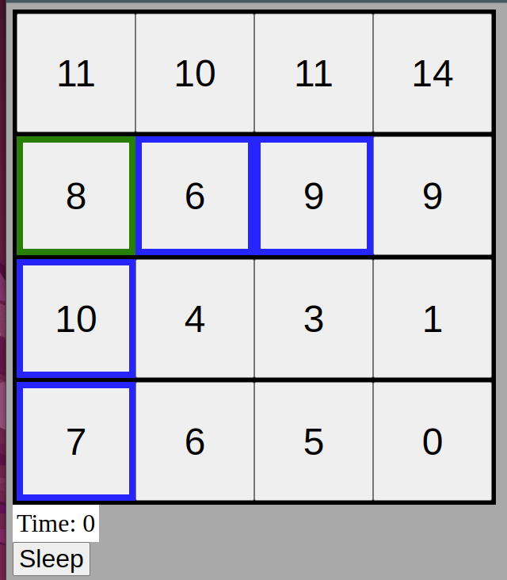

# Knight Moves 5
## Are there loops?
I'm not sure. What I mean is it possible to find an infinite loop that lets you accumulate time indefinitely without having a net effect on the altitudes across the board.

I think this should be impossible. For any position, there is *at least one* position with the same altitude (i.e. itself). There is always *at most one* diametrically opposite position with a *different* altitude. I.e. the best case for net altitude change is zero, and in any cases where $n\geq 2$ will lead to a net negative altitude change. So there should be zero infinite loops like this!


## When to stop searching?
Suppose we're searching the tree of all possible sequences of actions (i.e. jumps or sleeps). How do we know when to stop? Even if we have no valid jumps, we can always sleep, which might make it seem like we never know when to terminate. Indeed, sleeping could sometimes lead to a new valid jump becoming available later! However, if we sleep long enough, we'll sink too far below all nearby positions to ever make a future jump, thus terminating our search.

Ignoring one detail (which I'll think about after), each of these possible combinations of (row, column, altitude) changes imply the rightmost terminating condition based on altitude.

| $\Delta$Row | $\Delta$Col | Required $\Delta$Alt | Terminating $\Delta$Alt |
| ----------- | ----------- | -------------------- | ----------------------- |
| 0           | $\pm 1$     | $\pm 2$              | +3                        |
| 0           | $\pm 2$     | $\pm 1$              | +2                        |
| $\pm 1$     | 0           | $\pm 2$              | +3                        |
| $\pm 1$     | $\pm 2$     | 0                    | +1                        |
| $\pm 2$     | 0           | $\pm 1$              | +2                        |
| $\pm 2$     | $\pm 1$     | 0                    | +1                        |

To clarify with an example, if every cell that was $\pm 1$ rows away ($\Delta \text{Row} = \pm 1$) and in the same column ($\Delta \text{Col} = 0$), then we know that we will never reach them in the future by sleeping in the current position if their altitudes are $\geq 3$ above the curent altitude.

## What I *thought* was a caveat - opposite cell rises!
The possible caveat I mentioned above was this: what if the diametrically opposite cell is within the range of valid jumps?

This is actually not a problem at all! We know that this opposite cell will stay still at least, and will generally rise. So if its altitude matches/exceeds $\geq$ the appropriate terminating altitude mentioned above, then it too becomes unreachable.

This was just an edge-case I thought of, but we see that it's not really a problem!

## Can we brute-force?
Now that we have a terminating condition (of course "winning" is the other terminating condition!), can we perform a brute-force search, or is the search space still too large? There may be a heuristic for our search that could make it more likely to find a winning path sooner, but it definitely feels to me that there must be some other restrictions we can identify based on a bit of common sense logic.


## Accidental infinite loops
After coding up a brute-force search, I found that it would immediately get stuck in an infinite loop! This infinite loop was simply jumping back and forth between the same two positions ad infinitum. I thus added a check so that only positions that were not already in the same path for the same time $t$ were counted as valid jumps.


## Sinking together!
After implementing the above, I noticed that my search would still get stuck by infinitely sleeping on the same position, even though it could never jump to any other positions in the future. After some print statements I found something like this.

The grid state was printed as:
```python
[[  12.          332.66666667   11.           15.        ]
 [   8.            9.            9.            9.        ]
 [  10.         -318.66666667    0.            0.        ]
 [-318.66666667    6.         -318.66666667   -1.        ]]
```

The current position was `(3, 2)` (the bottom-right -318). Now, my program thought that it could possibly jump to `(3, 0)`, another -318 in the future! This is clearly impossible since it would need an altitude difference of $\pm 1$ in order to make such a jump, but these two positions would always sink in unison and so never reach such an altitude difference.

The issue was that my code checked if the target position was *less than* the desired target altitude (in this case, -317.6...). I had forgotten this case where the current position and the target position share the same altitude and so sink together, meaning the current state could *never* sink low enough to jump onto the target state.

The solution here is to note that if the target position is the same altitude as the current altitude, then sleeping will never let us jump to the target position.

UNLESS the target position is diametrically opposite to the current position! In which case, the current position could sink below the target position and maybe allow a jump.


### What's a "state"?
This is a sidenote on my terminology.

In my logic, a "state" is of the form `(time, (row, column))`. Note this is subtly different from the expected format of our final answer, where the time indicates the *duration at which you rest in the current position before jumping to the `(row, column)` position*. In my working, this simply represents the *current total time* passed and the *current position*. If I ever find a solution, it should be trivial to convert it to the desired format after the fact!

Sometimes I might be implicitly including the grid state or overall path too when I say "state", but hopefully it's obvious from the context in those cases!

## But can we *win*?
I felt that we still seemed to be getting too many useless searches. These were useless because it appeared impossible that they would ever hit the winning position at any time in the future. For example, after searching 600000 paths (having found 299627 "roadblocks", i.e. terminated paths), an example grid in the search looked like
```python
[[ 2.          2.          2.         15.        ]
 [ 2.          6.          2.         10.33333333]
 [ 2.          6.          3.          1.        ]
 [ 4.          6.          7.16666667  2.5       ]]
```

with a path containing 146 states! The issue here is that it *seemed* unlikely that the knight could ever reach the top-right corner since its height seemed to trump all others in the grid. I thus wanted to determine for sure when it was impossible for the knight to even reach the top-right corner at any future time.

This actually seems very difficult to analyse. My initial naive idea was to say that if all positions that could jump to the top-right corner had sunk too far below to reach it, then this must be a terminal state. However, we could make some of those positions rise by resting diametrically opposite to them, so perhaps they *could* become high enough to jump to the top-right corner in the future? How do we account for this?

But wait! At this point I only now paid attention to the *updated* instructions. I had ignored this until now because I didn't understand it at first, and then just forgot about it afterwards! Here it is:

> **Updated 11/6**: Due to some shortsightedness on our part we forgot to include the following extra rule. All “sinks” in a tour must be *necessary* sinks. That is, if a jump $(t, P)$ has $t > 0$, it *must* be the case that there exists a value $t\prime$ such that replacing $(t, P)$ with $(t\prime, P)$ would result in an illegal move *or* would cause a move later in the tour to be illegal. (Our tour operator regrets the oversight.)

So all of this time I had been thinking about valid actions being composed of valid jumps *and* valid sleeps, I was increasing the search space massively! We really only need to search for valid jumps, and *only if there are no valid moves*, check for a valid sleep!


## Updated problem
I now had gone back to getting recursion depth errors in Python. A "solution" to this would be increasing the allowed recursion depth that Python would accept before crashing, but this pointed to me to problems in our search. Printing out the grid and path before this crash, I saw a grid like
```python
[[ 3.71428571  3.71428571  3.71428571 15.28571429]
 [ 6.          6.          3.71428571  3.71428571]
 [11.65        3.71428571  3.          2.        ]
 [ 3.71428571  6.          7.1         1.        ]]
```

and a 980-element path like
```python
[..., (184, (2, 1)), (184, (0, 2)), (184, (2, 2)), (185, (2, 2)), (185, (2, 1)), (185, (3, 1)), (185, (1, 1)), (186, (1, 1)), (186, (1, 2)), (186, (0, 0)), (186, (1, 0)), (186, (3, 1)), (186, (3, 0)), (187, (3, 0)), (188, (3, 0))]
```

Looking at the path, I could see that it wasn't simply the knight sleeping on one position forever. It was truly moving between cells, but this seemed to bring us back to the problem of the top-right corner being way too high above the rest to possible be reachable in the future. But I still wasn't certain how to prove this.

Let's call the positions that *could* jump to the top-right corner, assuming they could reach the correct altitudes, the "candidate positions". I noticed that a candidate position could *not* be elevated if its diametrically opposite position was the same altitude. And that might actually be it, really. If all candidate positions are diametrically opposite to a position with the same altitude, *and* all candidate positions are already too far below the required altitude, then this means we will never reach the top-right corner.

Does that apply in my example above though? I don't think so actually, making this condition less useful than I might have thought. For example, position `(2, 3)` (zero-indexed) has an altitude of 2. Its diametrically opposite position has altitude 6. Therefore, we could imagine sleeping on the 6 until the 2 was high enough that it could jump into the top-right corner (i.e. had a height of 14.2857...). 

But we can see multiple problems here. One is that the fractional 0.2857 is very specific and would require some clever manipulations to try and make sure the 2 had the exact same fractional component. Further, what if, as the 6 sinks and the 2 rises, their altitudes match somewhere in the middle? Then, the 2 could no longer rise and we would be stuck again. This latter one is not so bad since it would still be caught as a terminal state, but would lead to unnecessary computations. To optimise this, we could note that there were 3 6's, and so they would sink at a rate of 1/3 while the 2 rises at a rate of 1/3. Since 6 and 2 have a difference that is an *even* multiple of 1/3, they would meet in the middle. To see why, suppose we instead had 2 and 3 as our altitudes, then we would have

| Rising altitude | Sinking altitude |
| --------------- | ---------------- |
| 2               | 3                |
| $2 \frac{1}{3}$ | $2 \frac{2}{3}$  |
| $2 \frac{2}{3}$ | $2 \frac{1}{3}$  |
| 3               | 2                |

Because 2 and 3 were an *odd* multiple of 1/3 apart, they never actually met in the middle! If instead we had 2 and 4, we would instead see

| Rising altitude | Sinking altitude |
| --------------- | ---------------- |
| 2               | 4                |
| $2 \frac{1}{3}$ | $3 \frac{2}{3}$  |
| $2 \frac{2}{3}$ | $3 \frac{1}{3}$  |
| 3               | 3                |

so altitudes that are an *even* multiple of the sinking/rising rate apart would meet in the middle.


## This is too complicated!
My problem is this all feels like too much. I would be perfectly happy if my search was imperfect, but still had a chance of quickly finding a desired path. I therefore decided to devise a **heuristic** to stop searching grids where it seemed "unlikely" that the top-right corner would ever be reachable.

I decided to go for a very greedy/restrictive heuristic. If at any point, the top-right corner was currently unreachable by any candidate positions, we would immediately stop the search. I was gambling that there would still be *some* such paths that would win the game while simultaneously eliminating an unimaginable number of potential paths.

### This heuristic sucks!
This heuristic was patently terrible though since it immediately stopped searching the example grid I was playing with! Still trying to keep the heuristic, I simply tried adding some factor to increase its leniency. I started with saying that if all target position altitudes were >2 times the required altitude difference below the target position, *then* we would stop. Otherwise, we would keep going in the hopes that some of the candidate positions could rise back up enough.

A leniency factor of 2 actually ended up being useless in this example, so I upped it to 3. This seemed to work terribly though, leading me back to recursion depth errors, only ending in *clearly* bad grid states like
```python
[[ 3.71428571  3.71428571  3.71428571 15.28571429]
 [ 6.          6.          3.71428571  9.25      ]
 [ 3.71428571  3.71428571  3.          2.        ]
 [ 3.71428571  6.          7.1         3.4       ]]
```

It *appears* impossible to me that we could ever reach the top-right corner from this grid state (the knight had ended up in the bottom left corner here).


## Ignoring floating point errors
Part of me actually hoped at this point that floating point errors could potentially be causing us to miss valid jumps (e.g. a jump might look like an altitude difference of 0.9999999 instead of 1 exactly due to accumulated errors).

However, I didn't actually want to bother thinking about this, particularly because I felt I was still missing some key logic from my "solution" so far...


## Making an interactive board to play with
At this point, I felt that me skipping straight into coding had resulted in a complete lack of intuition for what would constitute "good" vs "bad" moves in this game. Normally I would resort to pen and paper for such puzzles but I felt this would be too clunky in this case since I would constantly have to redraw the board and probably make mistakes when applying the rules.

I thus decided to make a quick and dirty "web app" to play around with a board. My code was pretty terrible but I eventually had something up and running. It looked like this:


The green border represents the current position of the knight and the blue represents valid jumps from the current position. At any time, you can "sleep" and the relevant cells will sink (and the opposite cell may rise). Here's another example from the same board:


As a sidenote, I also used proper fraction-handling for this version of the game, which made me realise I should really do the same in my original python implementation. The fractions resolve any possible floating point errors and also display more nicely than decimals do.


## Islands
One thing I noticed while playing with this was that it was not always obvious which cells you could jump to without sleeping. For example, in the first screenshot above, you can only reach R2C1. However, once you jump there, you find that you can reach many other cells now.



And so on. In fact, I found that more than half of the board was immediately reachable without sleeping, as indicated by the pink shading below,


I'm going to call these connected regions of cells "islands", which I guess is what you would call a "connected component" in graph theory class.

## Getting stuck at clunky fractions
Sometimes you may end up in a state like this,


Here we have 4 cells of height $5\, \frac{11}{20}$. In this state, we could only possibly jump to a nearby cell with a shared fractional component of $\frac{11}{20}$, of which there are none. So we are forced to sleep, but the sinking rate is $\frac{1}{4}$, meaning our fractional components are now stuck in $\left\{ \frac{1}{20}, \frac{6}{20}, \frac{11}{20}, \frac{16}{20} \right\}$. Since no other cells on the board already have such a fractional component, we are no truly stuck and have no hope of getting out of this situation.

### How did we end up here?
Say we start at this 9 here.


If we sleep, the 9's will sink at a rate of $\frac{1}{2}$. They will simply both do this until they reach the next integer, 8. However, the opposite cell (here it's 5) will also rise at this same rate. It too will become integer again at the same time as the 9's.

Now we have 3 8's and the same process repeats.


Here's where it gets interesting. We now have 4 7's, so they sink at a rate of $\frac{1}{4}$.


But now, the opposite cell, a 6, will meet them in the middle! I.e. after 2 sleeps, the board looks like this.


So the _sinking rate changes before they have sunk back down to an integer_! The sinking rate has gone from $\frac{1}{4}$ to $\frac{1}{5}$, so all of our sinking cells now go down to an awkward fraction, $\frac{3}{10}$!


The sinking rate is now back to $\frac{1}{4}$, but the damage has been done. Since $\frac{3}{10}$ is _not_ an integer multiple of $\frac{1}{4}$, we are now permanently stuck in this fractional limbo!